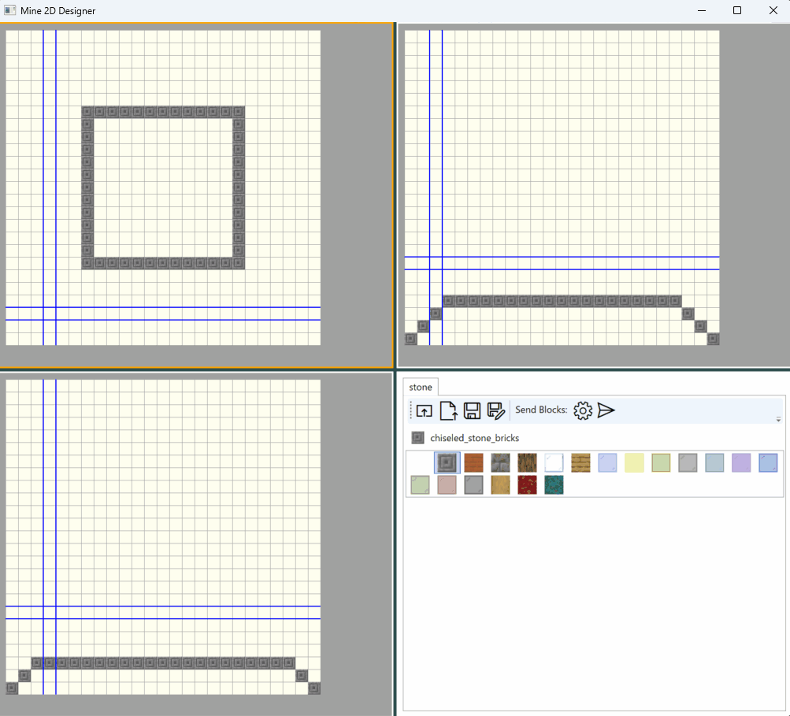
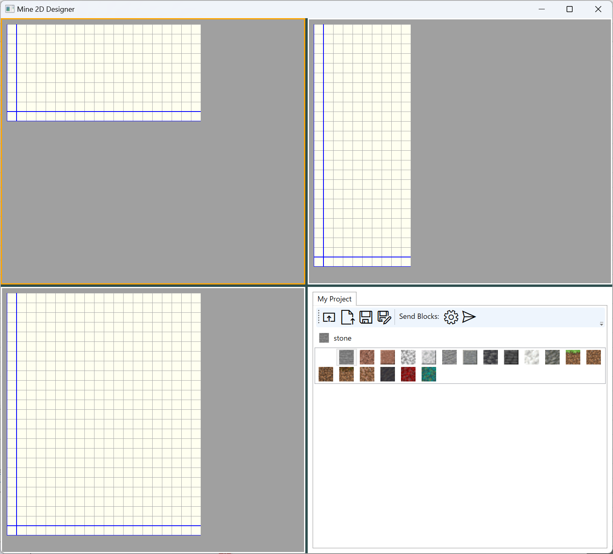
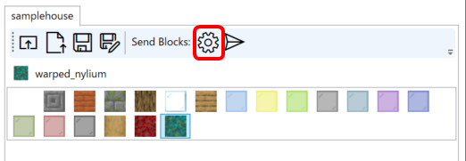

# Mine2DDesigner
This is a tool for designing block placement in Minecraft. (for Java Edition)
It displays a 3D space as a three-way section to assist in the placement of blocks.The designed blocks are placed on the Minecraft space via a remote console (RCON).

## Requirements
- Minecraft Java Edition 1.19 or newer
- Windows 10/11
- .NET6.0

## Dependencies
- [Windows Presentation Foundation (WPF)](https://github.com/dotnet/wpf)
- [ReactiveProperty](https://github.com/runceel/ReactiveProperty)
- [SkiaSharp](https://github.com/mono/SkiaSharp)
- [MinecraftConnection](https://github.com/takunology/MinecraftConnection)

## Installation
Download the latest version of the zip file from the release page and unzip it to any folder.
https://github.com/pierre3/Mine2DDesigner/releases

## Usage

### Running the application

Run the Mine2DDesigner.exe located in the unzipped folder.

### Creating a new project

1. Click the "New" button on the toolbar to open the project creation dialog.
   

|Item|Description|
|--|--|
|Name|Input the name of the project|
|Width|Specify the number of blocks in the X direction|
|Depth|Specify the number of blocks in the Z direction|
|Height|Specify the number of blocks in the Y direction|

1. Click the "OK" button to create a block area with the specified size.
   

### Selecting blocks

Select the block you want to use in the block list by clicking on it.

Double-clicking on a block will open the block selection dialog and allow you to change the block displayed in the block list.

> **Note**
> Currently, only cubic blocks are supported. Half-size and stair blocks are not supported.

### Placing blocks

#### Editor
The block placement editor consists of three frames.

- Frame1: Cross-section viewed from above (Y-axis direction)
- Frame2: Cross-section viewed from the side (Z-axis direction)
- Frame3: Cross-section viewed from the front (X-axis direction)

- The intersection of the horizontal and vertical guidelines (blue double lines) is the current cursor position. The cursor in each frame all points to the same block position.
- The frame with the orange border is the active frame.

#### Keyboard operation

Block placement operations are done using the keyboard.

|Key|Function|
|--|--|
|→|Move the cursor to the right on the active frame|
|←|Move the cursor to the left on the active frame|
|↑|Move the cursor up on the active frame|
|↓|Move the cursor down on the active frame|
|Page Up|Move the cross-section of the active frame forward|
|Page Down|Move the cross-section of the active frame backward|
|Space|Place a block at the cursor position. You can place blocks continuously by moving the cursor while holding down the space key|
|Z|Zoom in on the active frame's image|
|X|Zoom out on the active frame's image|
|Tab|Change the active frame|
|0-9|Switch the block to be placed. Numbers 0-9 are assigned in order from the left of the block list.|

## Sending the designed blocks to Minecraft

### Setting up Rcon

1. Click the "Rcon Settings" button on the toolbar to open the settings dialog.

|Item|Description|
|--|--|
|Server|Input the Rcon server name|
|Port|Input the Rcon port number|
|Password|Input the Rcon password|

2. Click the "OK" button to close the dialog after inputting the values.

### Sending blocks

2. Click the "Send Blocks" button on the toolbar to open the settings dialog.
   

|Item|Description|
|--|--|
|Start Pos.|Specify the coordinates to start placing blocks|
|Get Player Location|Retrieve the current location of the player specified in "Player ID"|
|Player ID|Specify the name of the player to retrieve the current location of|
|Replace Air Blocks|If checked, replaces unset areas with air blocks|
|Send Blocks|Executes the block placement command|

## Saving the project

Save the current state to a file.

- Size of the block area
- Placed blocks
- State of the block list

### Saving with a specified file name

Click the "Save as" button on the toolbar to open the "Save As" dialog.

### Overwriting save

When you click the "Save" button on the toolbar, it will save over an existing file.

## Opening the project

Open a file and restore the saved state.When you click the "Open" button on the toolbar, it will open the "Open File" dialog.

